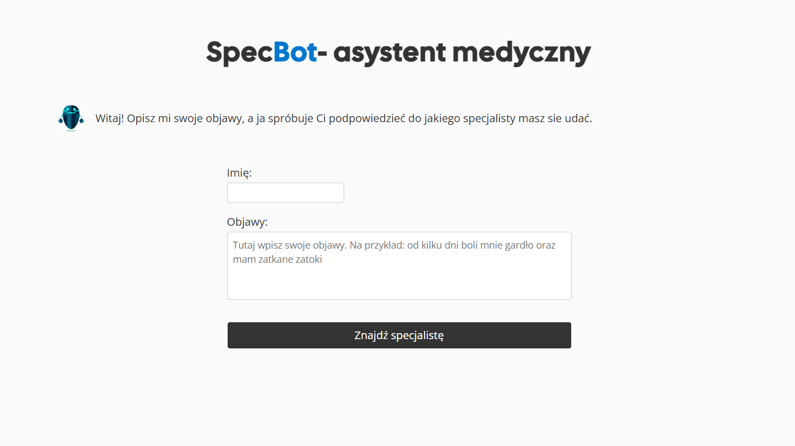
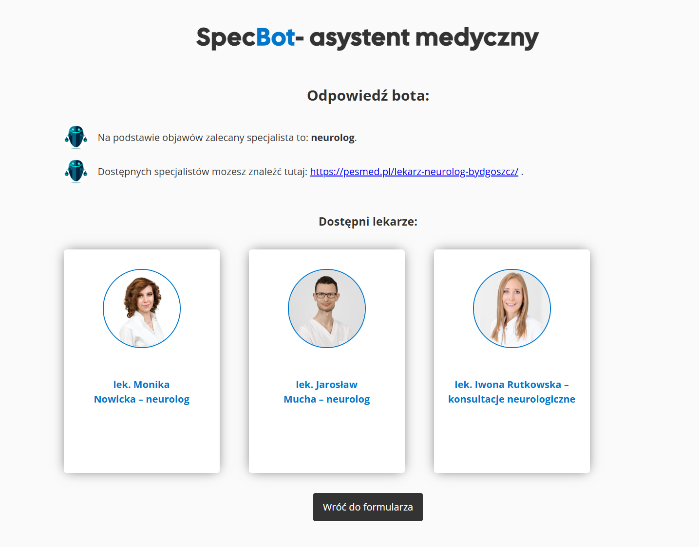

# SPECBOT
A web application powered by Flask and OpenAI that helps users find the right specialist based on their symptoms. 
It also scrapes a list of doctors from the Pesmed website and displays them on the page.

## Features
- A form to input name and symptoms.
- Analyzes symptoms with GPT and recommends a specialist.
- Web scraping of doctor list from Pesmed website.

## Technologies Used

- Python & Flask
- HTML / CSS 
- Jinja2 templating
- Web scraping with BeautifulSoup
- OpenAI API 

## Requirements

- Python 3.8+
- OpenAI API key 
- pip

## Screenshots

